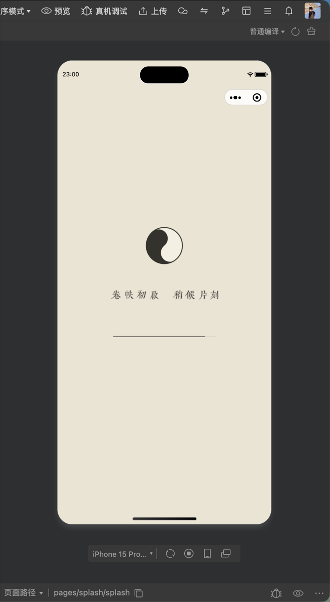
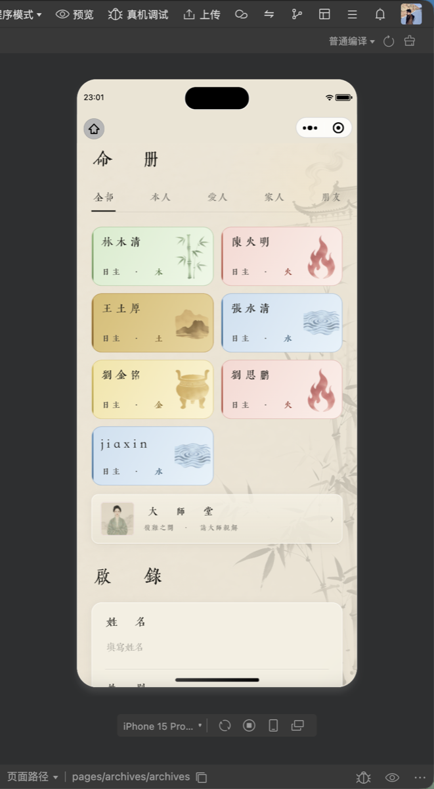
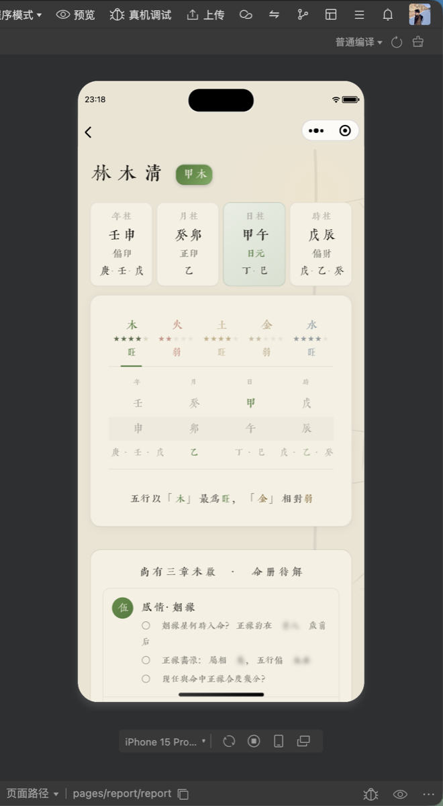
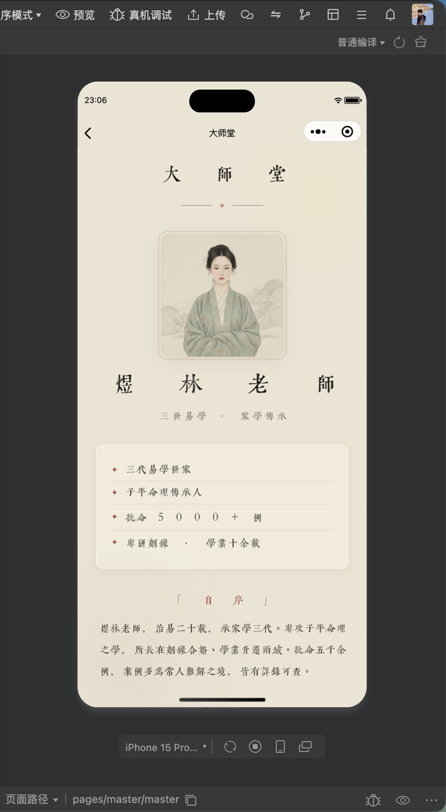
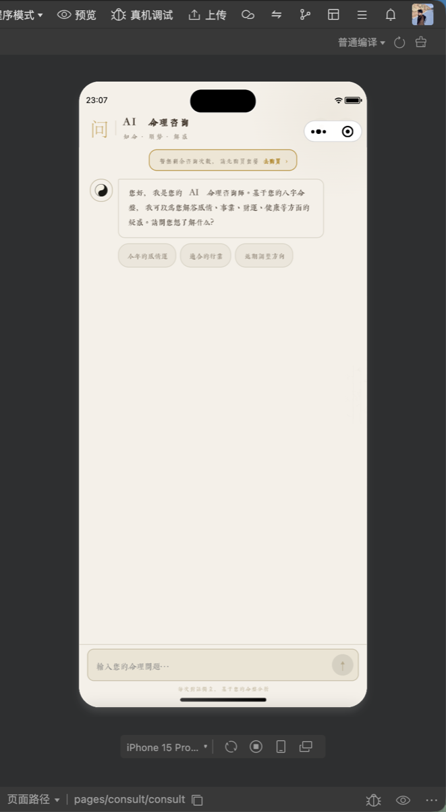

# 观易录

> 传统算法排盘 + AI 解读的微信小程序 —— 新中式极简，把晦涩的八字命理讲成普通人读得懂的话。

观易录用自研纯 JS 算法自动完成四柱、五行、大运排盘，再交给 AI 把命理结果转写成克制、不浮夸的文字报告。排盘绝不走大模型，只有「把结果讲清楚」这一步交给 AI——算得准，说得懂。

> 🚧 开发中（Work in Progress）。本仓库为**作品展示**，仅含说明与界面截图，不含源码。

---

## 解决什么问题

传统八字排盘门槛高、术语晦涩，普通人看到一张排盘表也读不懂。观易录把两件事拆开：

- **排盘**——四柱 / 五行 / 大运全部本地算法计算，零外部依赖，结果可复核；
- **解读**——AI 只负责把算出来的命理结果，转成有人话、有分寸的报告，不做断言、不贩卖焦虑。

---

## 功能与页面

| 页面 | 说明 |
| --- | --- |
| 加载页 `splash` | 启动引导，自定义古风字体加载 |
| 录入页 `input` | 录入生辰信息，生成命盘 |
| 命册 `archives` | 多人命盘管理，一处收纳本人与亲友的档案 |
| 命盘报告 `report` | 四柱排盘 + 五行禀赋 + 分章解读 |
| 大师堂 `master` | 命理师介绍与付费报告入口 |
| AI 命理咨询 `consult` | 基于本人八字的对话式解读 |

商业化：免费查看基础性格章节；付费报告走微信「米大师」虚拟支付。

---

## 界面一览

> UI 全部由本人设计：新中式极简、自定义 qiji 系列字体、统一的颜色 / 间距 / 字号 Design Token 体系。

<table>
<tr>
<td width="33%"> <b>加载页</b> · 卷帙初启，稍候片刻</td>
<td width="33%"> <b>命册</b> · 多人命盘管理</td>
<td width="33%"> <b>命盘报告</b> · 四柱 + 五行禀赋 + 分章</td>
</tr>
<tr>
<td width="33%"> <b>大师堂</b> · 命理师与报告入口</td>
<td width="33%"> <b>AI 命理咨询</b> · 基于八字的对话解读</td>
<td width="33%"></td>
</tr>
</table>

---

## 技术栈

- **前端**：微信小程序原生（WXML / WXSS / JS）
- **后端**：微信云开发 Serverless（Node.js 云函数）
- **AI**：DeepSeek Chat Completion API（JSON mode，分章并行调用）
- **排盘**：自研纯 JS 算法，零外部依赖——四柱 / 五行 / 大运全部本地计算，**排盘绝不走大模型**，AI 只做文字解读
- **设计**：新中式极简，自定义字体 + Design Token 变量体系

---

*观易录仍在开发中，本仓库用于作品展示。*
